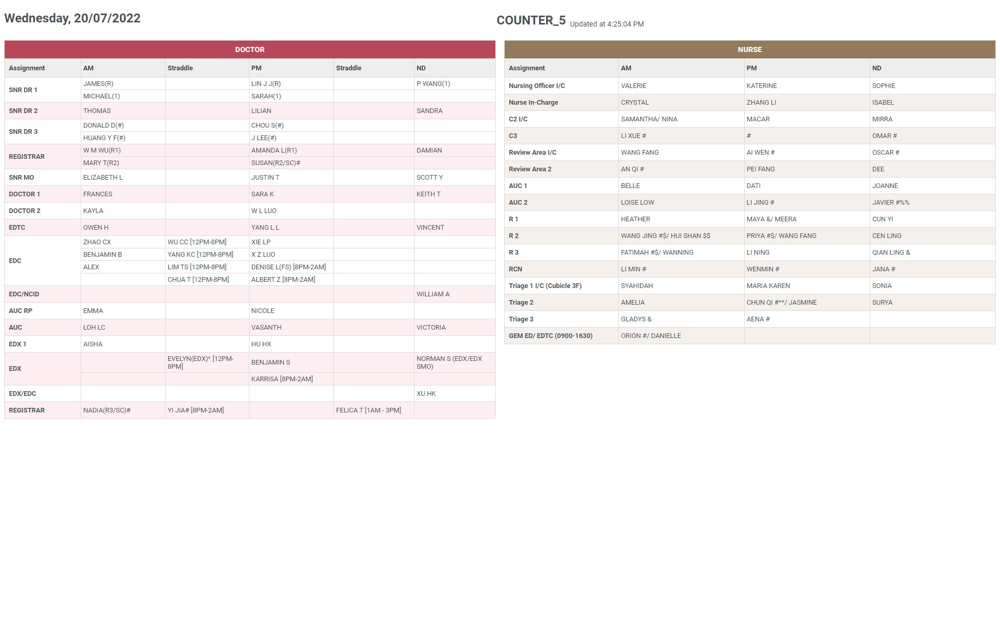
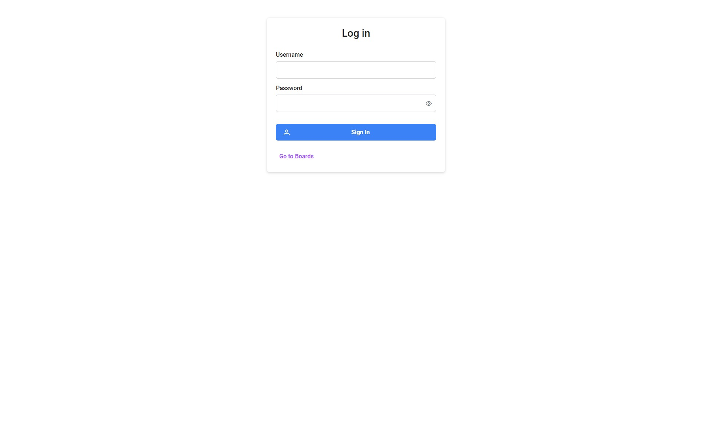
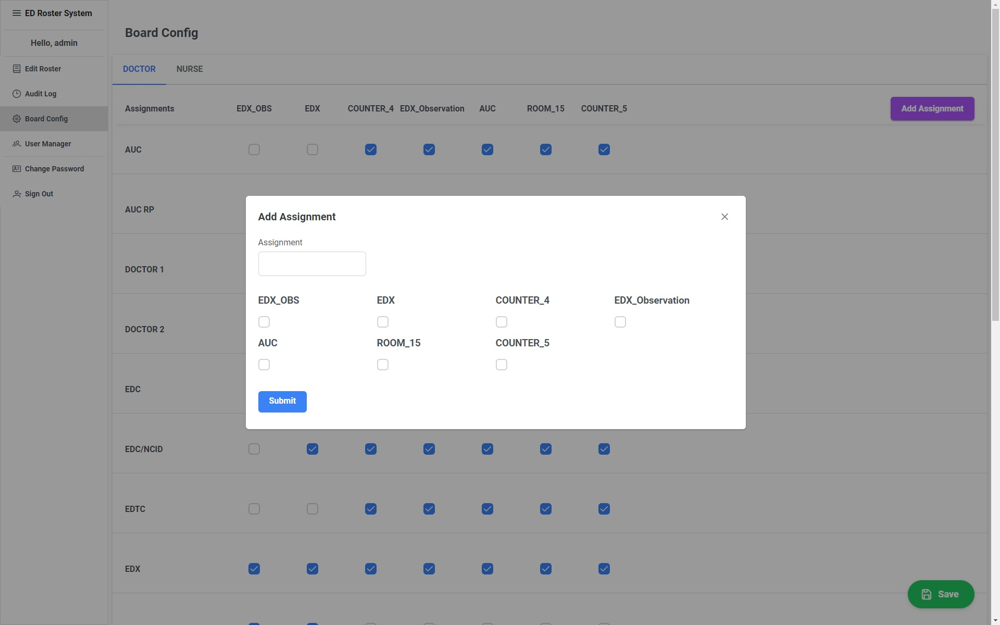

# User's Guide

## Installation 
View [README.md](../README.md)

## Features

### Viewing of Roster

Enter base site and click on name of board to view

Boards

Board

### Sign in to admin view

From base site, click on "Go To Admin View" or enter routes `/admin` or `/login` and key in username and password to enter admin view.

Log In 

Roster View

### Adding new rosters 

1. From Roster View Using Excel rosters
- Click on Add From Excel

- Upload the necessary files and click `Upload`
- Preview accuracy of the converted roster and click `Submit`

2. From Roster View 
- Click on the `+` icon next to the rosters date

- Click on date/ range of dates to be added and click `Confirm`

### Deleting new rosters 

From Roster View click on `x` on the top right of roster to be deleted, afterwhich, confirm deletion by clicking yes on the prompt. 

### Editing rosters

1. To edit entries simply click on the cell to be edited and make neccessary changes, all changes will be autosaved. 
2. To add new rows, click on the `New Row` Button and enter the assignment of the row to be added and click `Confirm` 
or 
From any existing row, click a cell and click the `+` icon to add a new row of the exisitng assignment
3. To reorder rows, click on reorder row and then click on the bar icons to reorder the rows
4. To delete rows either click on the delete icon on the right of each row or select rows to be deleted and click on the delete button on the top toolbar.

### View Audit Log

On the left tool bar of admin view click on Audit Log, or enter `/admin/audit`.

- User - Username of user who performed the operation
- Operation Time - Date and time the operation is performed
- Operation Type - Type of operation 
- Roster Date - Date of roster involved in operation (If Applicable)
### Changing Board Config (super-admin, admin)

On the left tool bar of admin view click on Board Config, or enter `/admin/config`.

1. Adding Assignments
- Click on `Add Assignment` button 

- Fill in assignment to be added and boards the assignment will be added to and click `Submit`

2. Adjusting board configuration 
- Click on checkbox of changes to be made
- Click on `Save` Button on the bottom right of the screen

### User Manager (super-admin, admin)
On the left tool bar of admin view click on User Manager, or enter `/admin/users`.

1. Add User
- Click on `Create User` and fill in username, password and role note that super-admin can create admin and user while admin can only create user accounts

2. Delete User
- Select user to be deleted and click on `Delete`

3. Change Password 
- Select user to change and click on `Change Password`. Click on `Confirm Change` to confirm.

### Change password

On the left tool bar of admin view click on `Change Password`.

Fill in current password and new password and click `Confirm Change` to confirm
